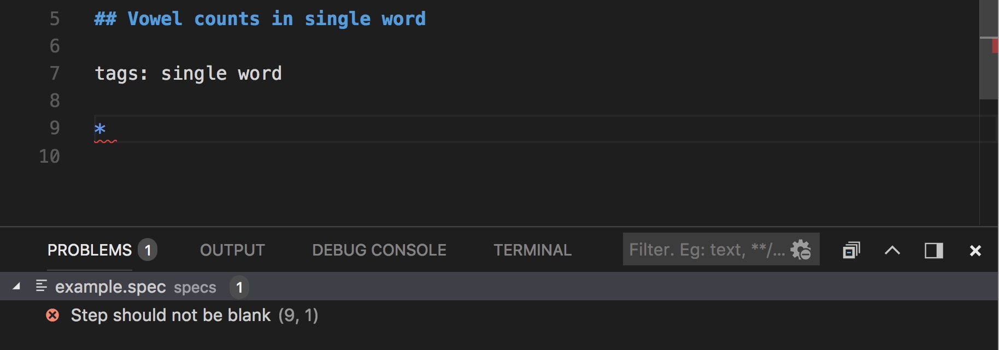
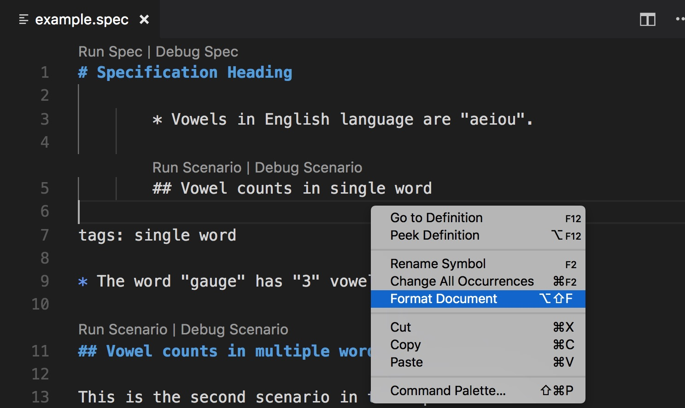

# gauge-vscode

[](https://marketplace.visualstudio.com/items?itemName=getgauge.gauge)
[](https://travis-ci.org/getgauge/gauge-vscode)
[](https://ci.appveyor.com/project/getgauge/gauge-vscode)

Gauge extension for [Visual Studio Code](https://code.visualstudio.com/)

## Install

```
$ code --install-extension getgauge.gauge
```
*Refer [here](#install-from-source) for more installation options*


## Features List
* [Create New Project](#create-new-project)
* [Code Completion](#code-completion)
* [Go to Definition](#goto-definition)
* [Diagnostics](#diagnostics)
* [Format Specifications](#format-specifications)
* [Step implemenatation references](#references)
* [Run Specifications/Scenarios](#run-specifications-and-scenarios)
* [Debug Specifications/Scenarios](#debug-specifications-and-scenarios-using-codeLens)
* [Execution Reports](#execution-report)
* [Test Explorer](#test-explorer)
* [Code Snippets](#snippets-for-specification,-scenarios-and-tables)

## Configuration

These configurations can be configured in [VSCode settings](https://code.visualstudio.com/docs/getstarted/settings).
* `gauge.launch.enableDebugLogs` :  Starts gauge lsp server with log-level `debug`. Defaults to `false`.
* `gauge.execution.debugPort` :  Defaults debug port to `9229`.
* `gauge.execution.specDirs` : List of specification directories which can be run by executing `Gauge: Run All Specifications` from command palette.
* `gauge.notification.suppressUpdateNotification` :  Stops showing notifications for gauge-vscode plugin auto-updates. Defaults to `false`.

## Troubleshooting

- Files not associated with Gauge.
If gauge features are not listed, the gauge extension may not be activated. The `.spec` and `.cpt` files may be associated with a different language. To fix this, you can add this to [user settings](https://code.visualstudio.com/docs/getstarted/settings).
```
"files.associations": {
	"*.spec": "gauge",
	"*.cpt": "gauge"
}
```
### Facing other issues?

Refer our [Troubleshooting](https://docs.getgauge.io/troubleshooting.html) guide.

### Talk to us

Please see below for the best place to ask a query:

- How do I? -- [Stack Overflow](https://stackoverflow.com/questions/ask?tags=getgauge)
- I got this error, why? -- [Stack Overflow](https://stackoverflow.com/questions/ask?tags=getgauge)
- I got this error and I'm sure it's a bug -- file an [issue](https://github.com/getgauge/gauge-vscode/issues)
	You can also easily report issues from VSCode itself by executing command `Gauge: Report Issue` from the command pallete.
- I have an idea/request -- file an [issue](https://github.com/getgauge/gauge-vscode/issues)
- Why do you? -- [Google Groups](https://groups.google.com/forum/#!forum/getgauge)
- When will you? -- [Google Groups](https://groups.google.com/forum/#!forum/getgauge)


## Gauge Features
### Create new project
Create a new Gauge Project from VSCode.
Execute the Command `Gauge: Create new Gauge Project` and select the appropriate template to create a new Gauge Project.


### Code Completion
Supports code completion for steps, parameters and tags.


### Goto Definition
You can navigate from a step to it implementation.


### Diagnostics
Shows errors in specifications.



### Format Specifications



### References
Shows step usages for a step implementation.


### Run specifications and scenarios

#### Run specifications and scenarios using codelens


#### Run all specifications from command palette

Execute command `Gauge: Run All Specification` to run all the specification in `specs` (default) directory. Use `gauge.execution.specDirs` configuration to add or remove spec directories.

#### Run specification from command palette

Execute command `Gauge: Run Specification` to run the current open specification.

#### Run scenarios from command palette

Execute command `Gauge: Run Scenarios` to choose a scenario form current specification and run.

#### Run scenario at cursor from command palette

Execute command `Gauge: Run Scenario At Cursor` to the scenario at cursor. It will ask to choose a scenario If cursor is not in scenario context.

#### Repeat last gauge execution from command palette

Execute command `Gauge: Repeat Last Run` to repeat last gauge execution.

#### Re-run failed scenarios from previous run

Execute command `Gauge: Re-Run Failed Scenario(s)` to repeat only failed scenarios from last gauge execution.

### Debug specifications and scenarios using codeLens
Debugging of specifications and scenarios is supported for JS, Python and Ruby.


### Execution Report
The execution status of Gauge execution can be viewed in VSCode.


### Test Explorer


### Snippets for specification, scenarios and tables
	`spec` - for specification
	`sce` - for scenario
	`table:1` - table with one column
	`table:2` - table with two columns
	`table:3` - table with three columns
	`table:4` - table with four columns
	`table:5` - table with five columns
	`table:6` - table with six columns


## Install from source

```shell
$ npm run build
```

This will create `gauge-<version>.vsix` file which can be installed via VScode's [Install from VSIX](https://code.visualstudio.com/docs/editor/extension-gallery#_install-from-a-vsix).

## Install Nightly version

Nightly version of vscode is available in bintray. To install a nightly version,
- [Uninstall](https://code.visualstudio.com/docs/editor/extension-gallery#_manage-extensions) existing version of gauge extension.
- Download the latest [nightly version of gauge extension](https://bintray.com/gauge/gauge-vscode/Nightly/_latestVersion) from bintray.
- [Install](https://code.visualstudio.com/docs/editor/extension-gallery#_install-from-a-vsix) gauge extension from source.

